# Computer Science Projects

These projects were created as part of [Codecademy's](https://www.codecademy.com) Computer Science Career Path course. (Latest projects are added to the top of the list.)

There were several portfolio projects created as part of this course. As they were larger and more extensive programs they can be found in their own repositories:

- [Portfolio Project: Recommendation Software](https://github.com/VTickner/codecademy-recommendation-software)
- [Portfolio Project: Python Terminal Game](https://github.com/VTickner/codecademy-python-terminal-game)

## Table of contents

- Math For Computer Science
- Computer Architecture
- [Databases](#databases)
  - [Traffic Analytics](#traffic-analytics)
  - [Database Normalisation At Fred's Furniture](#database-normalisation-at-freds-furniture)
  - [Intermediate Bookstore Indexes](#intermediate-bookstore-indexes)
  - [Bookstore Indexes](#bookstore-indexes)
  - [Data Exchange Service](#data-exchange-service)
  - [Building An Inventory Database With PostgreSQL](#building-an-inventory-database-with-postgresql)
  - [Designing A Database From Scratch](#designing-a-database-from-scratch)
  - [Database Triggers](#database-triggers)
  - [Build A Menu For Bytes Of China](#build-a-menu-for-bytes-of-china)
  - [The Best Of Baseball Awards](#the-best-of-baseball-awards)
  - [Lyft Trip Data](#lyft-trip-data)
  - [Analyse Hacker News Trends](#analyse-hacker-news-trends)
  - [Trends In Startups](#trends-in-startups)
  - [New York Restaurants](#new-york-restaurants)
  - [Create A Table](#create-a-table)
- [Trees And Graphs](#trees-and-graphs)
  - [Traveling Salesperson](#traveling-salesperson)
  - [Build A Routing Program To Help Vancouver Commuters](#build-a-routing-program-to-help-vancouver-commuters)
  - [Choose Your Own Adventure: Wilderness Escape](#choose-your-own-adventure-wilderness-escape)
- [Algorithms](#algorithms)
  - [Longest Common Subsequence](#longest-common-subsequence)
  - [A Sorted Tale](#a-sorted-tale)
- [Intro To Data Structures](#intro-to-data-structures)
  - [Blossom](#blossom)
  - [Towers Of Hanoi](#towers-of-hanoi)
- [Intro To Programming](#intro-to-programming)
  - [Guess The Number Game](#guess-the-number-game)
  - [Hacking The Fender](#hacking-the-fender)
  - [Scrabble](#scrabble)
  - [Thread Shed](#thread-shed)
  - [The Bored Tourist](#the-bored-tourist)
  - [Getting Ready For Physics Class](#getting-ready-for-physics-class)
  - [Carly's Clippers](#carlys-clippers)
  - [Len's Slice](#lens-slice)
  - [Gradebook](#gradebook)
  - [Sal's Shipping](#sals-shipping)
  - [Magic 8-Ball](#magic-8-ball)
- [Other](#other)
  - [Author](#author)

# Databases

## Traffic Analytics

The aim of this project was to use what has been learned in the course about database maintenance to manage a table, `sensors.observations` that receives constant updates.

- Use of `TRUNCATE` and `VACUUM` to help clear up space from deleted/updated data.
- Use of the following to help check files sizes of tables, indexes and total sizes:

  ```sql
  SELECT
    pg_size_pretty(pg_table_size('sensors.observations')) AS table_size,
    pg_size_pretty(pg_indexes_size('sensors.observations')) AS idx_size,
    pg_size_pretty(pg_total_relation_size('sensors.observations')) AS total_size;
  ```

### Code & Potential Improvements

- Solution URL: [Traffic Analytics](./databases/traffic_analytics.sql)

## Database Normalisation At Fred's Furniture

The aim of this project was to normalise a database by creating a new set of tables that contain all of the same information from the table `store`.

The database had the initial following schema:

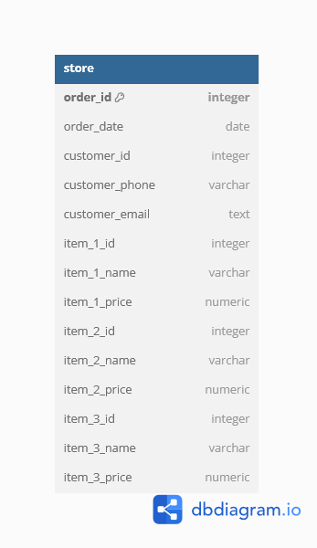

The database then was normalised and now has the following schema:

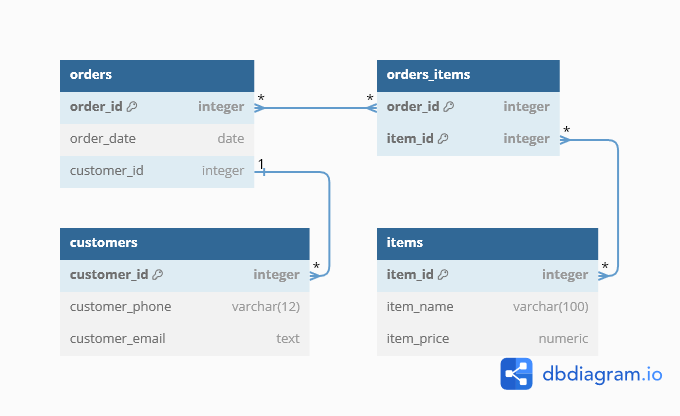

- Created tables based from the original `store` table by using a `SELECT` query (example below) as part of the `CREATE TABLE` statement:

  ```sql
  CREATE TABLE items AS
    SELECT DISTINCT
      item_1_id AS item_id,
      item_1_name AS item_name,
      item_1_price AS item_price
    FROM store
    UNION
    SELECT DISTINCT
      item_2_id AS item_id,
      item_2_name AS item_name,
      item_2_price AS item_price
    FROM store
    WHERE item_2_id IS NOT NULL
    UNION
    SELECT DISTINCT
      item_3_id AS item_id,
      item_3_name AS item_name,
      item_3_price AS item_price
    FROM store
    WHERE item_3_id IS NOT NULL;
  ```

### Code & Potential Improvements

- Solution URL: [Database Normalisation At Fred's Furniture](./databases/database_normalisation_at_fred_furniture.sql)

## Intermediate Bookstore Indexes

The aim of this project was to analyse runtime of adding more complex indexes to the previous [Bookstore Indexes](#bookstore-indexes) project.

- Use of `WHERE` conditions on analysing and indexing

  ```sql
  CREATE INDEX orders_total_price_over_100_idx
  ON orders((quantity * price_base > 100));

  EXPLAIN ANALYZE SELECT *
  FROM orders
  WHERE (quantity * price_base > 100);
  ```

### Code & Potential Improvements

- Solution URL: [Intermediate Bookstore Indexes](./databases/intermediate_bookstore_indexes.sql)

## Bookstore Indexes

The aim of this project was to analyse runtime and size of a database and the impact of creating indexes on tables.

- `EXPLAIN ANALYZE` to look at runtime
- `pg_size_pretty(pg_total_relation_size('table_name')` to look at size

  ```sql
  EXPLAIN ANALYZE SELECT
    original_language,
    title,
    sales_in_millions
  FROM books
  WHERE original_language = 'French';

  SELECT pg_size_pretty(pg_total_relation_size('books'));

  CREATE INDEX books_original_language_title_sales_in_millions_idx
  ON books(original_language, title, sales_in_millions);
  ```

### Code & Potential Improvements

- Solution URL: [Bookstore Indexes](./databases/bookstore_indexes.sql)

## Data Exchange Service

The aim of this project was to set up permissions on a PostgreSQL database that is storing data for a data sharing application that allows users to share datasets and metadata. A few select data publishers have been given access to the database and permissions need to be set up that allow these publishers to get relevant information about how users are interacting with the data they’ve uploaded.

- `SELECT current_user;`
- `SET ROLE role_name;`
- `CREATE ROLE role_name WITH role_types;`
- `CREATE ROLE role_group_name WITH role_types ROLE role_name;`
- `GRANT usage_type ON SCHEMA database_name TO role_group_name;`
- `GRANT usage_type ON ALL TABLES IN SCHEMA database_name TO role_group_name;`
- `SELECT * FROM information_schema.table_privileges;`
- `CREATE POLICY policy_name ON database_name.table_name FOR usage_type TO role_group_name USING (appropriate limitation);`
- `ALTER TABLE database_name.table_name ENABLE ROW LEVEL SECURITY;`

### Code & Potential Improvements

- Solution URL: [Data Exchange Service](./databases/data_exchange_service.sql)

## Building An Inventory Database With PostgreSQL

The aim of this project was to set constraints on a database used for keeping track of parts, their manufacturer, location in storeroom, inventory etc, to enable data quality checks to ensure that only valid data can be entered into the database.

The database had the initial following schema:

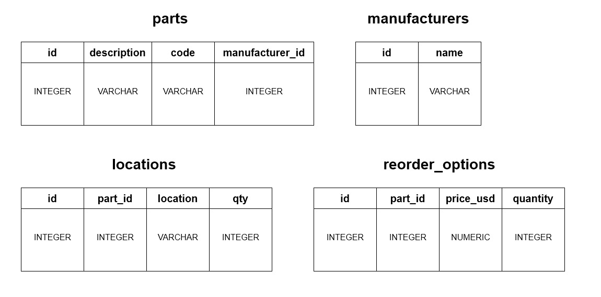

To ensure data quality the following were utilised on the tables as appropriate:

- `ADD UNIQUE (column_name)`
- `ALTER COLUMN column_name SET NOT NULL`
- `ADD CHECK (appropriate limitation)`
- `ADD PRIMARY KEY (column_name)`
- `ADD FOREIGN KEY (column_name) REFERENCES table_name(column_name)`

### Code & Potential Improvements

- Solution URL: [Building An Inventory Database With PostgreSQL](./databases/building_an_inventory_database_with_postgresql.sql)

## Designing A Database From Scratch

The aims of this project were to:

- Design a database schema on any topic.
- Implement the schema using Postbird (which is an open source PostgreSQL GUI client).

I chose to design a database around a hypothetical UK secondary school. I focused the database around people who would be closely associated with the school and how they are linked together to decide on what information to add and how to organise it. I designed the following schema for the database (I've included the [DBML database markup language file](./databases/school.dbml)):

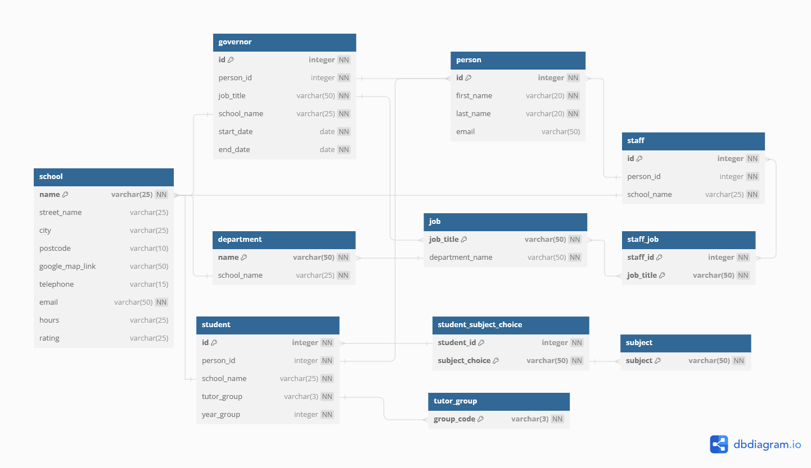

I got ChatGPT to generate hypothetical data based of the schema:

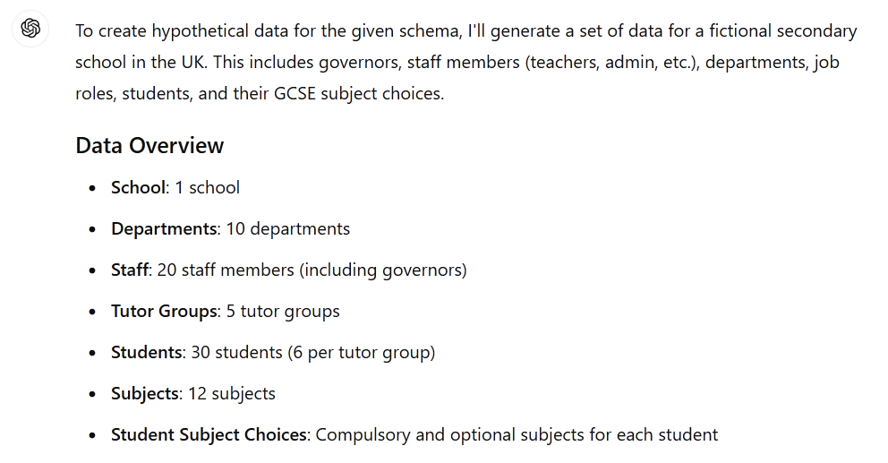

While using ChatGPT helped speed up the generation of data, it didn't keep the data consistent to what it was supposed to add for each individual. For instance, it added a staff member with a note to state they were an art teacher, but never added art teacher as a job. So there were some inconsistencies when trying to add the data that I needed to clear up when inserting data into the table.

### Code & Potential Improvements

- Solution URL: [Designing A Database From Scratch](./databases/school.sql)

- Originally I had most of the tables have id integers as primary keys, but I found that was extremely confusing when trying to add data, and double-checking what was in the table content (when viewing the database information). So I re-started the schema and database creation to simplify it and make the information more easily readable and understandable.
- I also added a few test queries to check that I could pull out information appropriately and as expected.

## Database Triggers

The aim of this project was to record when customer information is modified utilising the tables `customers` and `customers_log` by using `CREATE TRIGGER`.

- Examples of how to use triggers to record changes made to data:

  ```sql
  CREATE TRIGGER customer_updated
  BEFORE UPDATE ON customers
  FOR EACH ROW
  EXECUTE PROCEDURE log_customers_change();

  CREATE TRIGGER customer_insert
  AFTER INSERT ON customers
  FOR EACH STATEMENT
  EXECUTE PROCEDURE log_customers_change();
  ```

### Code & Potential Improvements

- Solution URL: [Database Triggers](./databases/database_triggers.sql)

## Build A Menu For Bytes Of China

The aim of this project was to design a database schema based around a fictional restaurant "Bytes of China" and perform the following tasks:

- Create tables
- Define relationships between tables
- Designate appropriate columns as keys
- Insert sample data and
- Make queries from the database

The database has the following schema:

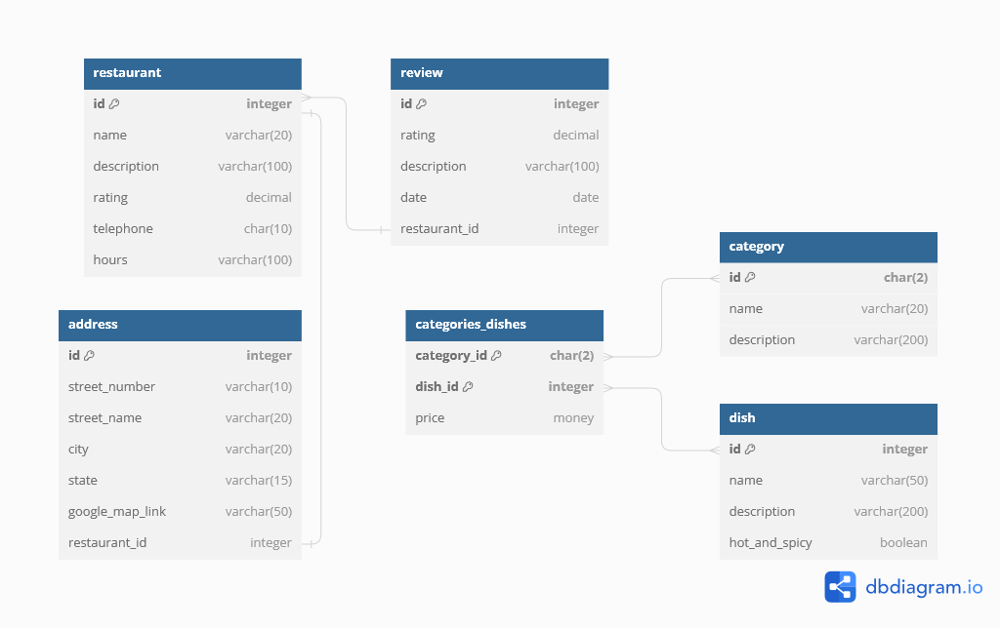

I learnt how to use [dbdiagram.io](https://dbdiagram.io) to create an accurate schema and also how to validate and check keys and relationships in the database using `information_schema.key_column_usage`:

```sql
SELECT
   constraint_name,
   table_name,
   column_name
FROM information_schema.key_column_usage
WHERE table_name = 'restaurant';
```

### Code & Potential Improvements

- Solution URL: [Build A Menu For Bytes Of China](./databases/build_a_menu_for_bytes_of_china.sql)

## The Best Of Baseball Awards

The aim of this project was make queries to a database containing multiple tables of baseball information containing information from 1871 to 2019 about players, teams, managers, salaries and plenty more (based off [Sean Lahman's database](http://www.seanlahman.com/)) using SQL commands.

- For the create your own award question, I did a variation of one of the previous questions (seeing as I know nothing about baseball). Worst Bang For Their Buck Award - This award goes to the team that has the largest "cost per win" in any given year. Answer apparently is New York Yankees, with 85 team wins in 2013, at $2,729,163 cost per win.
  ```sql
  SELECT
    ROUND(SUM(salaries.salary) / teams.w) AS "Cost Per Win",
    teams.w AS "Team Wins",
    teams.name AS "Team Name",
    salaries.yearid AS "Year"
  FROM salaries
  JOIN teams
    ON salaries.teamid = teams.teamid
    AND salaries.yearid = teams.yearid
  GROUP BY
    teams.name,
    salaries.yearid,
    teams.w
  ORDER BY 1 DESC;
  ```

### Code & Potential Improvements

- Solution URL: [The Best Of Baseball Awards](./databases/the_best_of_baseball_awards.sql)

## Lyft Trip Data

The aim of this project was make queries to a database containing multiple tables of Lyft trip data information using SQL commands knowledge to date and using `JOIN` and `UNION` commands. The database tables have the following schema:

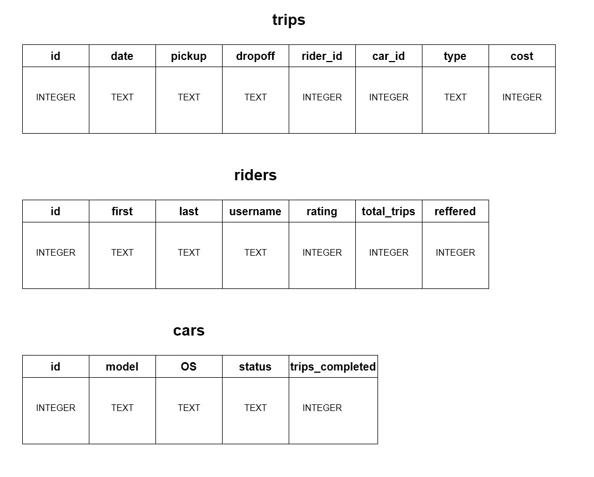

- Example use of `LEFT JOIN` where it was used to create a trip log with the trips and its users:
  ```sql
  SELECT trips.date,
    trips.pickup,
    trips.dropoff,
    trips.type,
    trips.cost,
    riders.first,
    riders.last,
    riders.username
  FROM trips
  LEFT JOIN riders
    ON trips.rider_id = riders.id;
  ```

### Code & Potential Improvements

- Solution URL: [Lyft Trip Data](./databases/lyft_trip_data.sql)

## Analyse Hacker News Trends

The aim of this project was make queries to a database table of Hacker News stories information using SQL commands knowledge to date and along with `strftime()` function. The database table has the following schema:

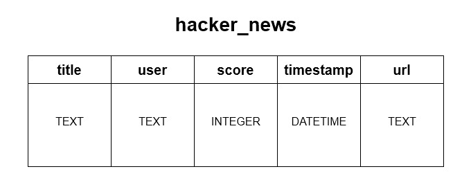

- Example use of `strftime()` where it was used to find the best time for users to post news stories to get the best scores:
  ```sql
  SELECT strftime('%H', timestamp) AS 'Hour',
    ROUND(AVG(score), 1) AS 'Average Score',
    COUNT(*) AS 'Number of Stories'
  FROM hacker_news
  WHERE timestamp IS NOT NULL
  GROUP BY 1
  ORDER BY 2 DESC;
  ```

### Code & Potential Improvements

- Solution URL: [Analyse Hacker News Trends](./databases/analyse_hacker_news_trends.sql)

## Trends In Startups

The aim of this project was make queries using aggregate functions to a database table of startup companies information using SQL commands. The database table has the following schema:

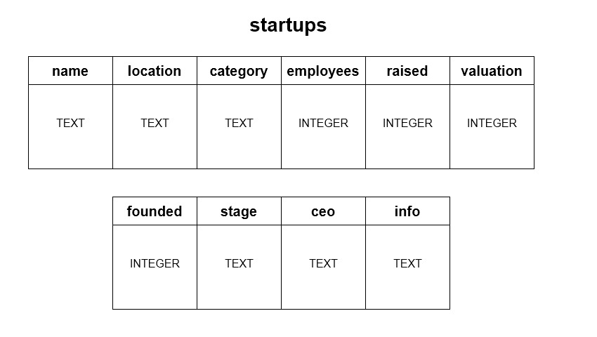

- Aggregate functions used: `COUNT()`, `SUM()`, `MAX()`, `MIN()`, `AVG()`, `ROUND()`
- `GROUP BY column_name;`
- `HAVING aggregrate function conditon;`

### Code & Potential Improvements

- Solution URL: [Trends In Startups](./databases/trends_in_startups.sql)

## New York Restaurants

The aim of this project was make queries to a database table of restaurant information using SQL commands. The database table has the following schema:

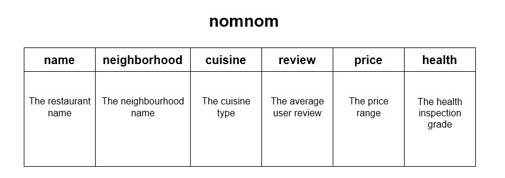

- `SELECT DISTINCT column_name FROM table_name;`
- `WHERE column_name condition;`
- `WHERE column_name LIKE pattern;`
- `WHERE column_name condition AND or OR column_name condition;`
- `WHERE column_name IS NULL;`
- `ORDER BY column_name DESC LIMIT number;`
- Also used `CASE`, `WHEN`, `THEN`, `ELSE`, `END AS`
  ```sql
  SELECT name,
    CASE
      WHEN review > 4.5 THEN 'Extraordinary'
      WHEN review > 4 THEN 'Excellent'
      WHEN review > 3 THEN 'Good'
      WHEN review > 2 THEN 'Fair'
      ELSE 'Poor'
    END AS 'Review'
  FROM nomnom;
  ```

### Code & Potential Improvements

- Solution URL: [New York Restaurants](./databases/new_york_restaurants.sql)

## Create A Table

The aim of this project was to create a friends table and add/delete data to it using basic SQL commands.

- `CREATE TABLE table_name (column_name data_type);`
- `INSERT INTO table_name (column_name) VALUES (data);`
- `SELECT column_name or * FROM table_name;`
- `UPDATE table_name SET column_name = data;`
- `ALTER TABLE table_name ADD COLUMN column_name data_type;`
- `DELETE FROM table_name WHERE column_name = data;`

### Code & Potential Improvements

- Solution URL: [Create A Table](./databases/create_a_table.sql)

# Trees And Graphs

## Traveling Salesperson

The aim of this project was to find the shortest path between each city that a traveling salesperson is to visit, and ending back up in the city where the salesperson started from. Unlike in the previous program [Build A Routing Program To Help Vancouver Commuters](#build-a-routing-program-to-help-vancouver-commuters) the distance between the places is taken into account with regards calculating the shortest distance.

- Imports `Graph` that finds paths, adds edges and vertices.
- Imports `Vertex` that gets edges and edge weights and adds edge weights
- Functions defined to:
  - `visited_all_nodes()` checks whether all vertices in the graph have been visited or not.
  - `traveling_salesperson()` takes a graph as a parameter and outputs the final path.
    - Sets all vertices in the graph as unvisited initially and are contained within a dictionary.
    - Selects an initial vertex at random and marks it as visited and adds it to the path.
    - Checks whether all nodes have been visited in the graph, whilst not all have been visited:
      - Creates a dictionary containing edges connected to the current vertex and their edge weights.
      - Checks to find the next vertex:
        - If there are no edge weights for the current vertex then break out of the loop.
        - Otherwise, select the minimum weight edge and check whether it points to a vertex that has already been visited or not. If unvisited then the next vertex has been found. If visited then pop off the edge weight and check the next edge weight.
      - If the dictionary of edge weights is empty, then all vertices have been visited.
      - Otherwise, the next vertex is made the current vertex and marked as visited and added to the path.
      - Checks whether all nodes have been visited in the graph.
    - Outputs the path.

### Code & Potential Improvements

- Solution URL: [Traveling Salesperson](./trees_and_graphs/traveling_salesperson.py)

- Other files:
  - [Graph.py](./trees_and_graphs/Graph.py)
  - [Vertex.py](./trees_and_graphs/Vertex.py)

## Build A Routing Program To Help Vancouver Commuters

The aim of this project was to create a routing program that users can select the starting and ending locations based of Vancouver landmarks and for the program to calculate a valid and shortest route between the two locations.

The program utilises graph depth-first (DFS) and breadth-first (BFS) search algorithms to work out whether there is a valid route (DFS) and to find the shortest route (BFS). In this case the shortest route is based off the number of stations along the route rather than time or distance between them.

Build A Routing Program To Help Vancouver Commuters code:

- Imports `graph_search` that has both a `dfs` and `bfs` search functions.
- Imports `vc_metro` that has a dictionary of stations and connections to other stations.
- Imports `vc_landmarks` that has a dictionary of landmarks and their associated stations.
- Imports `landmark_choices` that has a dictionary containing landmarks with associated keys to make it easier to select start and end destinations.
- Functions defined to:
  - `greet()` prints out a welcome message.
  - `get_start()` gets input from user for their starting location utilising dictionary keys `landmark_choices.keys()` to select the starting location.
  - `get_end()` gets input from user for their ending location utilising dictionary keys `landmark_choices.keys()` to select the ending location.
  - `set_start_and_end()` takes the user input to set the starting and end locations and also allows to change either start, end or both locations for the route.
  - `show_landmarks()` allows the user to print out the landmarks with their associated initial keys.
  - `new_route()` prints out whether there is a valid route and if so prints out the shortest route. It also allows the user to calculate another route.
  - `get_route()` calculates the route based off which stations are by the selected start and end landmarks. It calculates whether a route exists, and if there are any (closed) stations under construction that will impact a possible route. If a possible route exists it calculates the shortest route.
  - `get_active_stations()` updates the list of possible open stations, if any stations are currently marked as closed then that will be reflected in the list.
  - `goodbye()` prints out a goodbye message.
  - `skyroute()` that calls the main program functions and is utilised to run the program.

### Code & Potential Improvements

- Solution URL: [Build A Routing Program To Help Vancouver Commuters](./trees_and_graphs/skyroute.py)

  - I added an extra comparison check in `new_route()` to check that the start and end points are not the same.
  - I added an extra function `set_inactive_stations()` to allow the user to enter station names that are not open for use, allowing the program to be updated with current station closures, for more accurate route planning.

    ```python
    def set_inactive_stations():
      update_stations_closed = input("Do you wish to add stations that are closed for maintenance? Enter y/n: ")
      if update_stations_closed == "y":
        num_stations_closed = int(input("How many stations are under construction? "))
        for num in range(num_stations_closed):
          station = input("Enter station name {0}: ".format(num + 1))
          stations_under_construction.append(station)
        return stations_under_construction
    ```

- Other files:
  - [graph_search.py](./trees_and_graphs/graph_search.py)
  - [landmark_choices.py](./trees_and_graphs/landmark_choices.py)
  - [vc_landmarks.py](./trees_and_graphs/vc_landmarks.py)
  - [vc_metro.py](./trees_and_graphs/vc_metro.py)

## Choose Your Own Adventure: Wilderness Escape

The aim of this project was create an interactive "choose your own adventure" story. It utilises a tree data structure to hold the story pieces in each node of the tree in order to keep track of the different paths a user might choose.

- `TreeNode` class defined to:
  - `__init()__` initialises a story piece and an empty array for corresponding choices.
  - `add_child()` adds a choice for the appropriate story piece.
  - `traverse()` prints out the root story piece and then obtains the user's choice for which story option to next print out, and continues printing out the user's story choices until the end of the story is reached.

### Code & Potential Improvements

- Solution URL: [Wilderness Escape](./trees_and_graphs/wilderness_escape.py)
  - Add further story steps, before completion of the story.
  - Add more than two choices.

# Algorithms

## Longest Common Subsequence

The aim of this project was to use Dynamic Programming to determine the longest common subsequence between two strings. In other words, what series of letters from left to right do they share? The letters don’t need to be directly next to each other. In this example:

- String 1 = "ACCGTT"
- String 2 = "CCAGCA"
- Answer = "CCG"

As I'm new to the concept of Dynamic Programming, I've explained below the code and process for comparing the strings, as a way of helping me remember and understand the process of approaching this algorithm.

For the longest common subsequence, a grid will be needed where the columns are each character from one string, and the rows are each character from the other string. An extra column and row is added to represent an empty string or “no character”. The grid is created by two list comprehensions, one nested inside the other to create the columns and rows.

```python
grid = [[0 for col in range(len(string_1) + 1)] for row in range(len(string_2) + 1)]
```

A visual representation of the initial set-up of the grid:

```
     "" A  C  C  G  T  T
"" [ 0, 0, 0, 0, 0, 0, 0 ]
C  [ 0, 0, 0, 0, 0, 0, 0 ]
C  [ 0, 0, 0, 0, 0, 0, 0 ]
A  [ 0, 0, 0, 0, 0, 0, 0 ]
G  [ 0, 0, 0, 0, 0, 0, 0 ]
C  [ 0, 0, 0, 0, 0, 0, 0 ]
A  [ 0, 0, 0, 0, 0, 0, 0 ]
```

Each letter from one string is compared with each letter from the other string.

```python
for row in range(1, len(string_2) + 1):
  print("Comparing: {0}".format(string_2[row - 1]))

  for col in range(1, len(string_1) + 1):
    print("Against: {0}".format(string_1[col - 1]))
```

To fill in the grid with the comparisons - check if the letters match, if so there is a subsequence of at least 1. Any previous matches live in the cell of the grid that excludes the current characters: `grid[row - 1][col - 1]`. When the characters don't match, a value will be the best that's been seen excluding either character. In other words, the values located at the prior row or column. `max()` is used to return the higher value from `grid[row - 1][col]` and `grid[row][col - 1]`. Once the comparison is finished, the length of the longest common subsequence is located at `grid[-1][-1]`.

```python
if string_1[col - 1] == string_2[row - 1]:
  grid[row][col] = grid[row - 1][col - 1] + 1
else:
  grid[row][col] = max(grid[row - 1][col], grid[row][col - 1])
```

A visual representation of the grid after the comparisons have been completed:

```
     "" A  C  C  G  T  T
"" [ 0, 0, 0, 0, 0, 0, 0 ]
C  [ 0, 0, 1, 1, 1, 1, 1 ]
C  [ 0, 1, 1, 1, 1, 2, 2 ]
A  [ 0, 1, 1, 1, 2, 2, 2 ]
G  [ 0, 1, 1, 1, 2, 3, 3 ]
C  [ 0, 1, 2, 2, 2, 3, 3 ]
A  [ 0, 1, 2, 2, 3, 3, 3 ]
```

To find the actual subsequence itself, start from the bottom right cell of the grid, if the indices of each string are matching characters then they get added to the result and the indices are decremented. If they don't match then need to locate the position where they do match. As the answer is appended back to front it needs to be reversed (`answer.reverse()`) to be shown in the correct order.

```python
answer = []
while row > 0 and col > 0:
  if string_1[col - 1] ==  string_2[row - 1]:
    answer.append(string_1[col -1])
    col -= 1
    row -= 1
  elif grid[row - 1][col] > grid[row][col -1]:
    row -= 1
  else:
    col -= 1
answer.reverse()
return "".join(answer)
```

### Code & Potential Improvements

- Solution URL: [Longest Common Subsequence](./algorithms/longest_common_subsequence.py)

## A Sorted Tale

The aim of this project was to sort book data information that is read in via csv files and sorted using both bubble sort and quicksort algorithms.

A Sorted Tale code:

- Imports `utils` that reads in csv files.
- Imports `sorts` that has both a `bubble_sort` and a `quicksort` algorithm functions.
- Comparison functions were created that allowed both `bubble_sort` and `quicksort` functions to sort as per the comparison requested:

  ```python
  def by_title_ascending(book_a, book_b):
    return book_a["title_lower"] > book_b["title_lower"]

  def by_author_ascending(book_a, book_b):
    return book_a["author_lower"] > book_b["author_lower"]

  def by_total_length(book_a, book_b):
    return len(book_a["title"]) + len(book_a["author"]) > len(book_b["title"]) + len(book_b["author"])
  ```

Bubble sort algorithms work well on `books_small.csv` due to small amount of data and on data that is already reasonably sorted. However when applying to `books_large.csv` it noticeably is slow to run.

Quicksort algorithms work far better/quicker than bubble sort algorithms on larger amounts of data like in `books_large.csv`.

### Code & Potential Improvements

- Solution URL: [A Sorted Tale](./algorithms/a_sorted_tale.py)
  - I added an extra comparison function:
    ```python
    def by_title_descending(book_a, book_b):
      return book_a["title_lower"] < book_b["title_lower"]
    ```
- Other files:
  - [utils.py](./algorithms/utils.py)
  - [sorts.py](./algorithms/sorts.py)
  - [books_small.csv](./algorithms/books_small.csv)
  - [books_large.csv](./algorithms/books_large.csv)

# Intro To Data Structures

## Blossom

The aim of this project was to implement a hash map to relate the names of flowers with their meanings. Separate chaining using linked lists was used in order to avoid collisions when the hashing function collides the names of two flowers.

Blossom code:

- Makes use of Node and LinkedList classes
- HashMap class defined to:
  - `__init__()` initialises a hash map.
  - `_hash()` creates a hash code.
  - `_compress()` compresses the hash code so that it fits in size of the data array.
  - `assign()` adds data to the hash map using separate chaining of linked lists for collisions.
  - `retrieve()` gets data from the hash map using separate chaining.
- Creates a hash map utilising flower_definitions data from blossom_lib.

### Code & Potential Improvements

- Solution URL: [Blossom](./intro_to_data_structures/blossom.py)
- Other files:
  - [node.py](./intro_to_data_structures/node.py)
  - [linked_list.py](./intro_to_data_structures/linked_list.py)
  - [blossom_lib.py](./intro_to_data_structures/blossom_lib.py)

## Towers Of Hanoi

The aim of this project was to create a Towers of Hanoi game in Python using stacks to implement the game. Towers of Hanoi is an ancient mathematical puzzle that starts off with three stacks and many disks. The objective of the game is to move the stack of disks from the leftmost stack to the rightmost stack. The game follows three rules:

1. Only one disk can be moved at a time.
2. Each move consists of taking the upper disk from one of the stacks and placing it on top of another stack or on an empty rod.
3. No disk may be placed on top of a smaller disk.

Towers of Hanoi code:

- Makes use of Node and Stack classes to create the 3 stacks used in the game.
- Get input from user as to number of disks they want in the game (disks need to be >= 3).
- Calculates the number of optimal (minimum) moves based on number of disks:
  ```python
  num_optimal_moves = 2**num_disks - 1
  ```
- Get input from user as to which disk to move and where to place. (Checks are made to make sure the stack is not empty that a disk is taken from and also to not place a larger size disk on top of a smaller one.)

  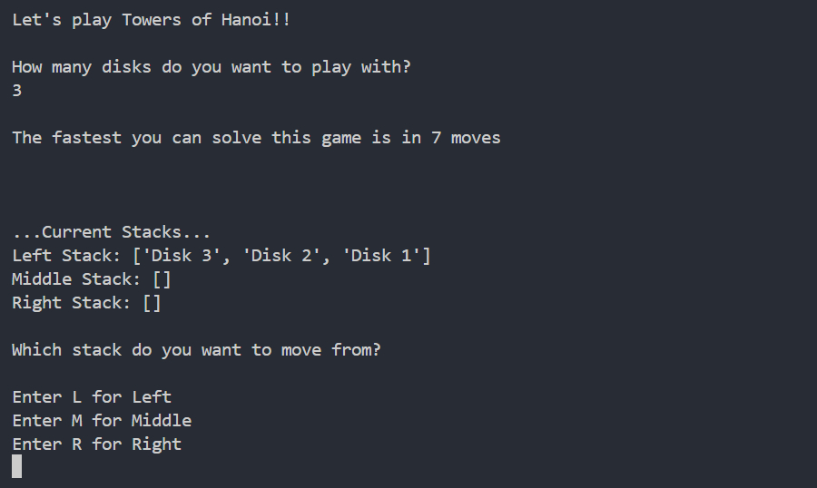
  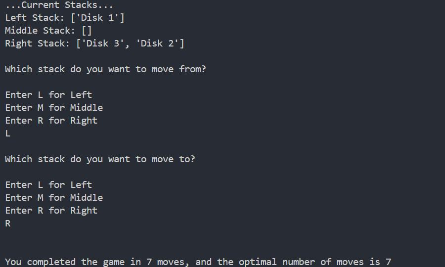

### Code & Potential Improvements

- Solution URL: [Towers Of Hanoi Game](./intro_to_data_structures/towers_of_hanoi_game.py)
  - Add a "play the game again" functionality.
- Other files:
  - [node.py](./intro_to_data_structures/node.py)
  - [stack.py](./intro_to_data_structures/stack.py)

# Intro To Programming

## Guess The Number Game

The aim of this project was to create a Python game that uses classes and objects. I chose to create a number guessing game. The goal of the game is to guess a number between 1 and 20. If the number isn't guessed correctly within 3 goes you lose a game round. There are overall stats that keep track of overall losses and wins for each round played.

- Classes defined to:

  - `Player`:

    - `__init__()` initialises name, lives (3) and creates an instance of GameStats of player.
    - `__repr__()` states how many lives player has left.
    - `reduce_life()` decreases the amount of player lives left.
    - `add_win()` calls GameStats to add a win to the overall game stats.
    - `add_loss()` calls GameStats to add a loss to the overall game stats.

  - `GameStats`:

    - `__init__()` initialises total wins and losses at 0.
    - `__repr__()` states overall wins and losses for player.
    - `add_win()` adds a win to the overall game stats.
    - `add_loss()` adds a loss to the overall game stats.

  - `GuessTheNumber`:
    - `__init__()` creates an instance of GameStats to initialise the game stats.
    - `__repr__()` prints a welcome message to the game.
    - `play_game()`:
      - Calls `__repr__()` to print out the welcome message.
      - Creates an instance of `Player` with the users name that they have entered.
      - `while` loop to loop around while user wants to continue to play.
        - Generates random number between 1 and 20 using `import random` and `random.randint(1, 20)`.
        - `while` loop to loop around while user has lives left.
          - User enters their guess.
          - If guess is correct `player.add_win()` is used to add a win to player's overall stats.
          - If guess is incorrect player loses a life via `player.reduce_life()` and `player()` is called to print the amount of lives left.
        - Once a player has lost all their lives, the game is over and `player.add_loss()` is used to add a loss to the player's overall stats.
      - Print out overall game stats for total amount of losses and wins.
      - Ask if user wants to continue playing another round of the game.

  Create an instance of `GuessTheNumber` and then call `play_game()` to run the game.

### Code & Potential Improvements

- Solution URL: [Guess The Number Game](./intro_to_programming/guess_the_number_game.py)
  - I didn't follow the exact specifications listed below, as it didn't make sense for this game with regards the amount of instances or attributes. So for potential improvements it would be to make alterations to the game, possibly having 2 players playing at once taking turns to be able to be able to meet the exact specifications below.
  - Specifications were:
    - Minimum of 2 classes - DONE
    - Use constructor `__init__()` - DONE
    - Each class to have minimum 3 attributes and 3 methods - GameStats only has 2 attributes
    - Each class to describe themselves `__repr()__` - DONE
    - Create 2 instances of each class
    - Create methods / attributes that make classes interact with each other - DONE

## Hacking The Fender

The aim of this project was to create a Python program that reads and writes to files. Extracting `Username` information from `passwords.csv` to create a list of user names in `compromised_user.csv`. Creating `boss_message.json` and `new_passwords.csv`.

- Imported `csv`, `json` and `os`.
- `with open("file_name", "w")` used to write files, "w" omitted when using only for reading.
- `csv.DictReader()` used to read passwords.csv file.
- `json.dump(dictionary_name, json_file_name)` used to write information to json file from Python dictionary.
- `file_object.write("text_to_add")` used to write information to file.

### Code & Potential Improvements

- Solution URL: [Hacking The Fender](./intro_to_programming/hacking_the_fender.py)
- Other files:
  - [boss_message.json](./intro_to_programming/boss_message.json)
  - [compromised_users.txt](./intro_to_programming/compromised_users.txt)
  - [new_passwords.csv](./intro_to_programming/new_passwords.csv)
  - [passwords.csv](./intro_to_programming/passwords.csv)

## Scrabble

The aim of this project was to create a Python program that processes some data from a group of friends playing scrabble. Dictionaries are used to organise players, words and points.

- List comprehension used to create a dictionary from two provided lists of letters and their points.

  ```python
  letters_to_points = {key:value for key, value in zip(letters, points)}
  ```

- Functions defined to:

  - `play_word()` adds a new word played by a player.

    - Sets `word.upper()` as letters in letters_to_points dictionary are all uppercase.
    - Sets `player.title()` so that if names are entered differently with lowercase or uppercase letters they will still match when compared to `player_to_words` dictionary.
    - If player already exists, word is added to their played list in player_to_words dictionary.
    - If player doesn't exist, then the new player along with their word is added to player_to_words dictionary.
    - Calls `update_point_totals()` function.

  - `update_point_totals()` updates the total points scored for the player.

    - Calls `score_word()` function.
    - If player already exists, points are added to their total score in player_to_points dictionary.
    - If player doesn't exist, then the new player along with their score is added to player_to_points dictionary.

  - `score_word()` calculates and returns the points score of a word.

  - `play_round()` initialises the program.

    - Gets player name and word from user.
    - Calls `play_word()` function.
    - Calls `another_round()` function.

  - `another_round()` asks user whether they wish to enter another player's word.

    - Gets Y/N input from user. Input changed to uppercase.
    - If response is `Y` or `YES`, then calls `play_round()` function.
    - If response not `Y` or `YES`, then calls `show_results()` function.

  - `show_results()` iterates through `player_to_points` dictionary to print out names and total scores of each player.

### Code & Potential Improvements

- Solution URL: [Scrabble](./intro_to_programming/scrabble.py)
  - Remove hardcoded player's data and ask for input of name and word from user - ADDED TO CODE.
  - Check whether more words to be added and scored - ADDED TO CODE.
  - Show overall results of players in formatted strings - ADDED TO CODE.

## Thread Shed

The aim of this project was to create a Python program that takes a list of sales information in a string format (customer name, price, colour(s) of thread purchased and date), and then use a variety of techniques to clean up the data into easier-to-access information.

- `string.replace()` used to help with clarifying appropriate sales transaction.
- `string.split()` used to help split up string into appropriate sections.
- `string.strip()` used to clear up and remove whitespace in transaction information.
- `for` loops used to iterate through lists of transactions.
- `list.append` to add information into smaller appropriate groups of lists e.g. customers, sales price and colour of thread purchased.
- Function defined to calculate the total numbers sold for each colour thread.
- `print` and `.format()` used to print out a formatted string of the number of each colour thread purchased.

### Code & Potential Improvements

- Solution URL: [Thread Shed](./intro_to_programming/thread_shed.py)

## The Bored Tourist

The aim of this project was to create a Python program that uses functions to create a recommendation program based on the traveler's location and their interests (e.g. museum, beach etc) for suggesting appropriate places for them to visit.

- Functions defined to:
  - Get index of destination from list of destinations.
  - Get traveler location.
  - Add attractions for each location.
  - Find all attractions for a particular destination.
  - Get attractions for traveler (based on their location and interests).
- Print out list of suitable attractions to visit for the traveler.
- Values to test the program are all hardcoded into the program.

### Code & Potential Improvements

- Solution URL: [The Bored Tourist](./intro_to_programming/the_bored_tourist.py)
  - Have the user enter their details - name, traveler location and interests.
  - Be able to update lists of locations and attractions interactively.

## Getting Ready For Physics Class

The aim of this project was to create a Python program that uses functions and `return` to help calculate some fundamental physics properties.

- Functions defined to calculate:
  - Fahrenheit to Celsius temperatures
  - Celsius to Fahrenheit temperatures
  - Force
  - Energy
  - Work
- Values to test the program are hardcoded into the program.

### Code & Potential Improvements

- Solution URL: [Getting Ready For Physics Class](./intro_to_programming/getting_ready_physics_class.py)
  - Have the user choose which physics property to calculate.
  - Have the user enter appropriate values for the physics property they have chosen to calculate.

## Carly's Clippers

The aim of this project was to create a Python program that calculates some metrics from lists of data.

- Lists of hairstyles, prices and last week's sales are hardcoded into the program.
- `for`, list comprehensions, `range()`, `len()` and `if` are used to calculate average prices, decreased prices, total revenue, average daily revenue and types of haircuts that cost less than £30.

### Code & Potential Improvements

- Solution URL: [Carly's Clippers](./intro_to_programming/carlys_clippers.py)

## Len's Slice

The aim of this project was to create a Python program that takes pizzas and their prices using lists and alters the lists to organise the data.

- 2D lists of pizzas and prices are hardcoded into the program.
- `list.count(item)` used to count how many pizzas are $2.
- `len(list)` used to count the number of different kinds of pizzas.
- `list.sort()` to sort the list in ascending order of price.
- `list.pop()` to remove the most expensive pizza.
- `list.insert(index, item)` to add a new pizza in appropriate position to keep price sorted in list.
- `list[:3]` to find the cheapest three pizzas.

### Code & Potential Improvements

- Solution URL: [Len's Slice](./intro_to_programming/lens_slice.py)

## Gradebook

The aim of this project was to create a Python program that takes student data and organizes subjects and grades using lists.

- 2D lists of subjects and grades are hardcoded into the program.
- `list.append(item)`, `list[index].remove(item)` are used to alter subjects and grades and `print()` out gradebook information to the user.

### Code & Potential Improvements

- Solution URL: [Gradebook](./intro_to_programming/gradebook.py)
  - Have the user input the initial subjects and grades.
  - Have the user be able to alter subjects and grades.

## Sal's Shipping

The aim of this project was to create a Python program that asks the user for the weight of their package and then tells them which method of shipping is cheapest and how much it will cost to ship their package using Sal’s Shippers.

- `weight` variable is hardcoded into the program.
- `if`, `elif` and `else` used to calculate cost shipping and `print()` out costs.

### Code & Potential Improvements

- Solution URL: [Sal's Shipping](./intro_to_programming/shipping.py)
  - Have the user input the packages weight.

## Magic 8-Ball

The aim of this project was to create a Python program that can answer any "Yes" or "No" question with a different fortune each time it executes.

- `name` and `question` variables are hardcoded into the program.
- `random` module with `randint()` used to generate a random number within a specified range.
- `if`, `elif` and `else` used to select answers and `print()` out appropriate response.

### Code & Potential Improvements

- Solution URL: [Magic 8-Ball](./intro_to_programming/magic-8.py)
  - Have the user input their name and question.

# Other

## Author

- V. Tickner
